# Introduction
A traversal represents one (and only one) path through vGraph, with any associated data it picks up along the way. When a traversal encounters a step where it can follow two paths, the traversal splits into two, each copy following one path. If a traversal encounters a boundary node, the traversal is transfered to the other repository and continues on.

## Simple Traversal (1 path)

**We start on a Node**

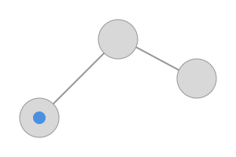

**We follow an Edge to an adjacent Node**

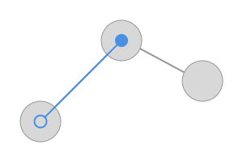

**We stop when we're done**

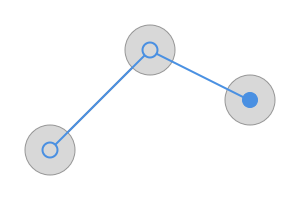

## Branching Traversal

**If we have a running traversal**

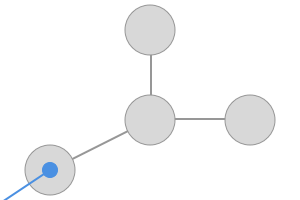

**We proceeds normally until we encounter a branch**

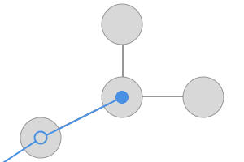

**We then copy the traversal and follow both branches**

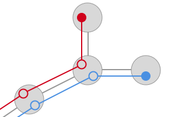

## Back Tracking Traversal

**Anytime during a traversal**

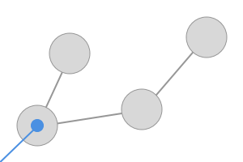

**We can mark our spot and take one path**

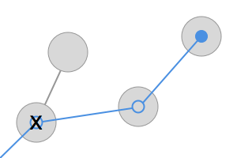

**We can then return to the spot we marked**

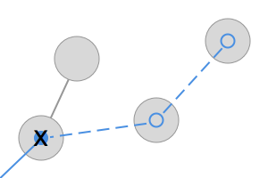

**And take a different path**

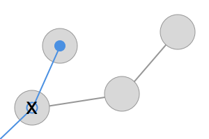

## Cross-Repository Traversal

**Anytime during a traversal**

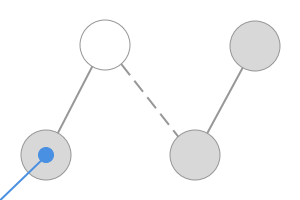

**If we hit a boundary node**

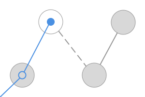

**We transfer the traversal over to the other repository**

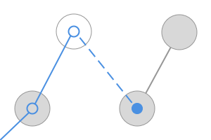

**And we continue our traversal**

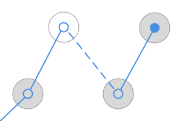
