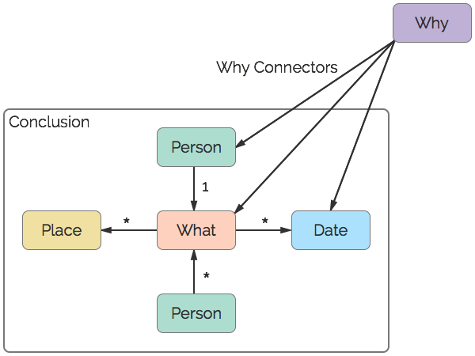

# pTree
A genealogical data model for [vGraph](https://github.com/trepo/vgraph). pTree is for conclusions, facts, and events, supporting evidence, and more.

# Version
**0.1.0** - October 2015

# Definitions

* `What` - A representation of something that happened. A fact or event.
* `Person` - A special node whose sole purpose is to be an identifier. No information is stored on a person.
* `Place` - A special node representing a place.
* `Date` - A special node representing a date.
* `Conclusion` - A collection (or sub-graph) of nodes connected by edges. Note that `Why Connectors` are NOT considered a part of a conclusion.
* `Why` - A Representation of why we believe something happened. A Source or Proof.
* `Why Connector` - The link between `Whats` and `Whys`. This is the ONLY edge allowed between `What` Nodes and `Why` Nodes.

# Specification

## Core

These are used in multiple conclusions, and are defined here.

* [Person](spec/person.md) - A Person, used solely as an identifier.
* [Place](spec/place.md) - A Place.
* [Date](spec/date.md) - A Date.

## What

Below is a list of conclusions:

* [Adoption](spec/adoption.md) - An adoption by one or more parents.
* [Annulment](spec/annulment.md) - An annulment of a marriage.
* [Birth](spec/birth.md) - An actual birth event. Parents associated with this event are biological. Adoptions, Guardianships, and Foster events are considered separate.
* [Burial](spec/burial.md) - A burial.
* [Christening](spec/christening.md) - A christening.
* [Cremation](spec/cremation.md) - A cremation.
* [Death](spec/death.md) - A death event. Burial and Cremation events are considered separate conclusions.
* [Divorce](spec/divorce.md) - A divorce.
* [Foster](spec/foster.md) - A child is fostered by one or more parents.
* [Gender](spec/gender.md) - The gender of a person.
* [Guardianship](spec/guardianship.md) - A guardianship.
* [Marriage](spec/marriage.md) - A marriage event.
* [Name](spec/name.md) - A persons name(s).
* [Occupation](spec/occupation.md) - An occupation.
* [Religion](spec/religion.md) - A religion.

## Why

To Be Defined

# Notes

1. You will notice that there are no "Parent/Child" or "Spouse" style conclusions. That is because the parent/child relationship is inferred based on several factors, including (but not limited to) divorce, remarriage, biological vs legal parent/child relationship(adoptions, guardianships, foster care, etc). There is also differing opinions on how these factors are to be interpreted. Some of the most common parent/child API functionality is provided in the Traversal section of the API.