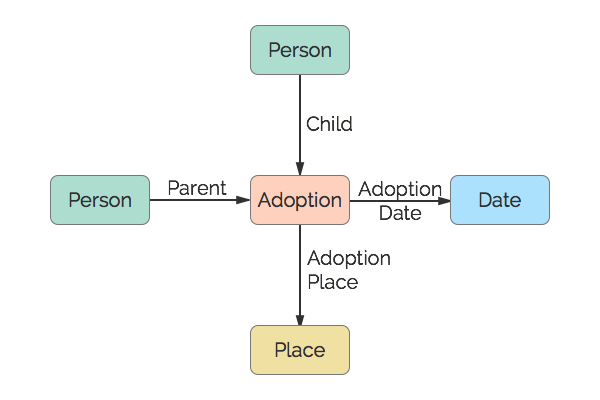

# Adoption
An Adoption.

## Restrictions

* Only one Child per Adoption
* Max of two Parents per Adoption
* Only one Date per Adoption
* Only one Place per Adoption

## Nodes

### Adoption

*Label:* `Adoption`

*Properties:* `(none)`

## Edges

### Child

*Label:* `Adoption_Child_Ref`

*From:* `Person`

*To:* `Adoption`

*Properties:* `(none)`

### Parent

*Label:* `Adoption_Parent_Ref`

*From:* `Person`

*To:* `Adoption`

*Properties:* `(none)`

### Adoption Date

*Label:* `Adoption_Date_Ref`

*From:* `Adoption`

*To:* `Date`

*Properties:* `(none)`

### Adoption Place

*Label:* `Adoption_Place_Ref`

*From:* `Adoption`

*To:* `Place`

*Properties:* `(none)`