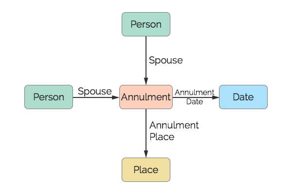

# Annulment
An annulment of a Annulment.

## Restrictions

* Only one Date per Annulment.
* Only one Place per Annulment.
* A maximum of two Spouses per Annulment.

## Nodes

### Annulment

*Label:* `Annulment`

*Properties:* `(none)`

## Edges

### Spouse

*Label:* `Annulment_Spouse_Ref`

*From:* `Person`

*To:* `Annulment`

*Properties:* `(none)`

### Annulment Date

*Label:* `Annulment_Date_Ref`

*From:* `Annulment`

*To:* `Date`

*Properties:* `(none)`

### Annulment Place

*Label:* `Annulment_Place_Ref`

*From:* `Annulment`

*To:* `Place`

*Properties:* `(none)`