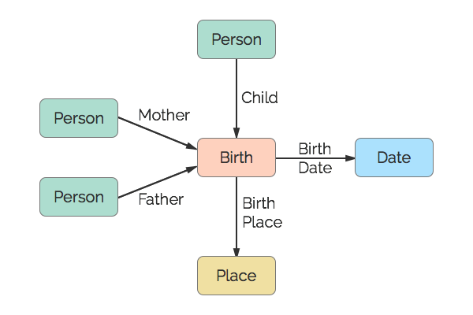

# Birth
This represents an actual birth event. Parents associated with this event are biological. Adoptions, Guardianships, and Foster events are considered separate conclusions.

## Restrictions

* Only one Child per Birth
* Only one Father per Birth
* Only one Mother per Birth
* Only one Date per Birth
* Only one Place per Birth

## Nodes

### Birth

*Label:* `Birth`

*Properties:* `(none)`

## Edges

### Child

*Label:* `Birth_Child_Ref`

*From:* `Person`

*To:* `Birth`

*Properties:* `(none)`

### Mother

*Label:* `Birth_Mother_Ref`

*From:* `Person`

*To:* `Birth`

*Properties:* `(none)`

### Father

*Label:* `Birth_Father_Ref`

*From:* `Person`

*To:* `Birth`

*Properties:* `(none)`

### Birth Date

*Label:* `Birth_Date_Ref`

*From:* `Birth`

*To:* `Date`

*Properties:* `(none)`

### Birth Place

*Label:* `Birth_Place_Ref`

*From:* `Birth`

*To:* `Place`

*Properties:* `(none)`