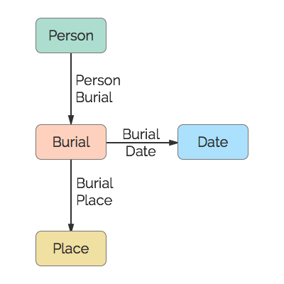

# Burial
A burial.

## Restrictions

* Only one Person per Burial
* Only one Date per Burial
* Only one Place per Burial

## Nodes

### Burial

*Label:* `Burial`

*Properties:* `(none)`

## Edges

### Person Burial

*Label:* `Burial_Person_Ref`

*From:* `Person`

*To:* `Burial`

*Properties:* `(none)`

### Burial Date

*Label:* `Burial_Date_Ref`

*From:* `Burial`

*To:* `Date`

*Properties:* `(none)`

### Burial Place

*Label:* `Burial_Place_Ref`

*From:* `Burial`

*To:* `Place`

*Properties:* `(none)`