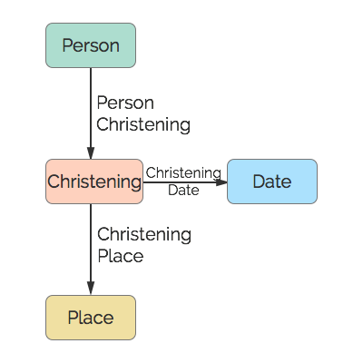

# Christening
A christening.

## Restrictions

* Only one Person per Christening
* Only one Date per Christening
* Only one Place per Christening

## Nodes

### Christening

*Label:* `Christening`

*Properties:* `(none)`

## Edges

### Person Christening

*Label:* `Christening_Person_Ref`

*From:* `Person`

*To:* `Christening`

*Properties:* `(none)`

### Christening Date

*Label:* `Christening_Date_Ref`

*From:* `Christening`

*To:* `Date`

*Properties:* `(none)`

### Christening Place

*Label:* `Christening_Place_Ref`

*From:* `Christening`

*To:* `Place`

*Properties:* `(none)`