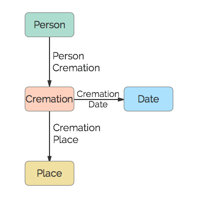

# Cremation
A cremation.

## Restrictions

* Only one Person per Cremation
* Only one Date per Cremation
* Only one Place per Cremation

## Nodes

### Cremation

*Label:* `Cremation`

*Properties:* `(none)`

## Edges

### Person Cremation

*Label:* `Cremation_Person_Ref`

*From:* `Person`

*To:* `Cremation`

*Properties:* `(none)`

### Cremation Date

*Label:* `Cremation_Date_Ref`

*From:* `Cremation`

*To:* `Date`

*Properties:* `(none)`

### Cremation Place

*Label:* `Cremation_Place_Ref`

*From:* `Cremation`

*To:* `Place`

*Properties:* `(none)`