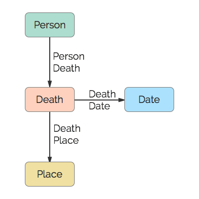

# Death
This represents an actual death event. Burial and Cremation events are considered separate conclusions.

## Restrictions

* Only one Person per Death
* Only one Date per Death
* Only one Place per Death

## Nodes

### Death

*Label:* `Death`

*Properties:* `(none)`

## Edges

### Person Death

*Label:* `Death_Person_Ref`

*From:* `Person`

*To:* `Death`

*Properties:* `(none)`

### Death Date

*Label:* `Death_Date_Ref`

*From:* `Death`

*To:* `Date`

*Properties:* `(none)`

### Death Place

*Label:* `Death_Place_Ref`

*From:* `Death`

*To:* `Place`

*Properties:* `(none)`