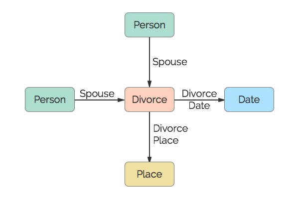

# Divorce
A divorce.

## Restrictions

* Only one Date per Divorce.
* Only one Place per Divorce.
* A maximum of two Spouses per Divorce.

## Nodes

### Divorce

*Label:* `Divorce`

*Properties:* `(none)`

## Edges

### Spouse

*Label:* `Divorce_Spouse_Ref`

*From:* `Person`

*To:* `Divorce`

*Properties:* `(none)`

### Divorce Date

*Label:* `Divorce_Date_Ref`

*From:* `Divorce`

*To:* `Date`

*Properties:* `(none)`

### Divorce Place

*Label:* `Divorce_Place_Ref`

*From:* `Divorce`

*To:* `Place`

*Properties:* `(none)`