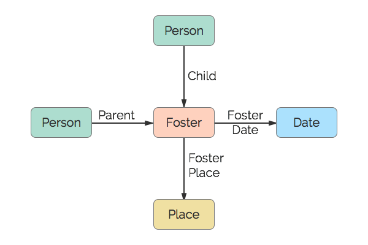

# Foster
A fostership.

## Restrictions

* Only one Child per Foster
* Max of two Parents per Foster
* Only one Date per Foster
* Only one Place per Foster

## Nodes

### Foster

*Label:* `Foster`

*Properties:* `(none)`

## Edges

### Child

*Label:* `Foster_Child_Ref`

*From:* `Person`

*To:* `Foster`

*Properties:* `(none)`

### Parent

*Label:* `Foster_Parent_Ref`

*From:* `Person`

*To:* `Foster`

*Properties:* `(none)`

### Foster Date

*Label:* `Foster_Date_Ref`

*From:* `Foster`

*To:* `Date`

*Properties:* `(none)`

### Foster Place

*Label:* `Foster_Place_Ref`

*From:* `Foster`

*To:* `Place`

*Properties:* `(none)`