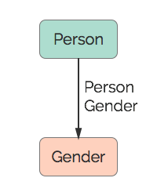

# Gender
A gender.

## Restrictions

* Only one Person per Gender
* `Gender's` property `gender` must be one of: `male`, `female`

## Nodes

### Gender

*Label:* `Gender`

*Properties:*

* `gender` (String) - The person's gender.

## Edges

### Person Gender

*Label:* `Gender_Person_Ref`

*From:* `Person`

*To:* `Gender`

*Properties:* `(none)`