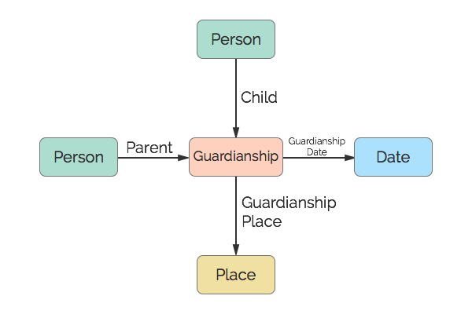

# Guardianship
A guardianship.

## Restrictions

* Only one Child per Guardianship
* Max of two Parents per Guardianship
* Only one Date per Guardianship
* Only one Place per Guardianship

## Nodes

### Guardianship

*Label:* `Guardianship`

*Properties:* `(none)`

## Edges

### Child

*Label:* `Guardianship_Child_Ref`

*From:* `Person`

*To:* `Guardianship`

*Properties:* `(none)`

### Parent

*Label:* `Guardianship_Parent_Ref`

*From:* `Person`

*To:* `Guardianship`

*Properties:* `(none)`

### Guardianship Date

*Label:* `Guardianship_Date_Ref`

*From:* `Guardianship`

*To:* `Date`

*Properties:* `(none)`

### Guardianship Place

*Label:* `Guardianship_Place_Ref`

*From:* `Guardianship`

*To:* `Place`

*Properties:* `(none)`