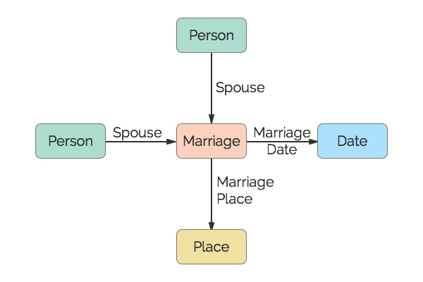

# Marriage
This represents a marriage event.

## Restrictions

* Only one Date per Marriage.
* Only one Place per Marriage.
* A maximum of two Spouses per Marriage.

## Nodes

### Marriage

*Label:* `Marriage`

*Properties:* `(none)`

## Edges

### Spouse

*Label:* `Marriage_Spouse_Ref`

*From:* `Person`

*To:* `Marriage`

*Properties:* `(none)`

### Marriage Date

*Label:* `Marriage_Date_Ref`

*From:* `Marriage`

*To:* `Date`

*Properties:* `(none)`

### Marriage Place

*Label:* `Marriage_Place_Ref`

*From:* `Marriage`

*To:* `Place`

*Properties:* `(none)`