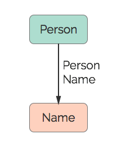

# Name
A name.

## Restrictions

* Only one Person per Name

## Nodes

### Name

*Label:* `Name`

*Properties:*

* `name` (String) - The person's name.

## Edges

### Person Name

*Label:* `Name_Person_Ref`

*From:* `Person`

*To:* `Name`

*Properties:* `(none)`