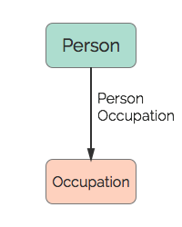

# Occupation
An occupation.

## Restrictions

* Only one Person per Occupation

## Nodes

### Occupation

*Label:* `Occupation`

*Properties:*

* `occupation` (String) - The person's Occupation.

## Edges

### Person Occupation

*Label:* `Occupation_Person_Ref`

*From:* `Person`

*To:* `Occupation`

*Properties:* `(none)`