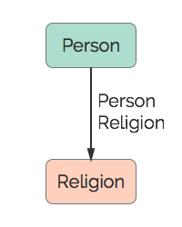

# Religion
A religion.

## Restrictions

* Only one Person per Religion

## Nodes

### Religion

*Label:* `Religion`

*Properties:*

* `religion` (String) - The person's Religion.

## Edges

### Person Religion

*Label:* `Religion_Person_Ref`

*From:* `Person`

*To:* `Religion`

*Properties:* `(none)`