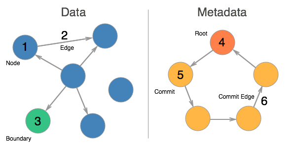

# vGraph
A distributable, versioned property graph.

[Conceptual Introduction](intro.md).

# Version
**Spec Version:** 0.7.0
**Commit Version:** 4
**Data Version:** 2

# API Specification
The vGraph specification is language agnostic. All operations performed on the underlying graph **must be completed as specified** to maintain cross-platform compatibility.

**Note:** The specification is written assuming that all operations to the underlying graph happen in sequence and not in parallel with any other function's operations. This means that the underlying graph needs to provide transactions OR you must serialize functions that have writes in them to prevent corruption.

### VGraph

* [Constructor(Repo, Graph)](function/vgraph-constructor.md) - Create and initialize a new instance of vGraph.
* [addNode(Label)](function/vgraph-addnode.md) - Add a Node.
* [removeNode(ID)](function/vgraph-removenode.md) - Remove a Node.
* [getNode(ID)](function/vgraph-getnode.md) - Get a Node.
* [getNodes([Labels])](function/vgraph-getnodes.md) - Get Nodes optionally filtered by labels.
* [addEdge(Label, From, To)](function/vgraph-addedge.md) - Add an Edge.
* [removeEdge(ID)](function/vgraph-removeedge.md) - Remove an Edge.
* [getEdge(ID)](function/vgraph-getedge.md) - Get an Edge.
* [getEdges([Labels])](function/vgraph-getedges.md) - Get Edges optionally filtered by labels.
* [addBoundary(ID, Label, Repo)](function/vgraph-addboundary.md) - Add a Boundary Node.
* [info()](function/vgraph-info.md) - Get Information about this vGraph instance.
* [getCommit(ID)](function/vgraph-getcommit.md) - Get a commit.
* [log(Number, Offset)](function/vgraph-log.md) - Get commit log entries.
* [status([Author, Email, Message])](function/vgraph-status.md) - Get a Commit representing the uncommitted changes.
* [reset()](function/vgraph-reset.md) - Remove all uncommitted changes.
* [commit(Author, Email, Message)](function/vgraph-commit.md) - Commit all changes in the graph.
* [undo(ID)](function/vgraph-undo.md) - Undo all commits back to ID.
* [patch(Commit)](function/vgraph-patch.md) - Patch vGraph with the Commit.
* [clone()](function/vgraph-clone.md) - Clone the graph.
* [copy(Author, Email, Message, [Nodes])](function/vgraph-copy.md) - Copy all or part of the graph.
* [merge(Commit)](function/vgraph-merge.md) - Reformat a Commit for this graph.

### Element

* [getId()](function/element-getid.md) - Get the element id.
* [getLabel()](function/element-getlabel.md) - Get the element label.
* [getProperty(Key)](function/element-getproperty.md) - Get a property.
* [setProperty(Key, Value)](function/element-setproperty.md) - Set a property.
* [removeProperty(Key)](function/element-removeproperty.md) - Remove a property.
* [getPropertyKeys()](function/element-getpropertykeys.md) - Gets an array of property keys.
* [getProperties()](function/element-getproperties.md) - Get properties.
* [setProperties(Properties)](function/element-setproperties.md) - Set properties.

### Node
(Inherits from Element)

* [getProperty(Key)](function/node-getproperty.md) - Get a property.
* [setProperty(Key, Value)](function/node-setproperty.md) - Set a property.
* [removeProperty(Key)](function/node-removeproperty.md) - Remove a property.
* [getPropertyKeys()](function/node-getpropertykeys.md) - Gets an array of property keys.
* [getProperties()](function/node-getproperties.md) - Get properties.
* [setProperties(Properties)](function/node-setproperties.md) - Set properties.
* [getRepo()](function/node-getrepo.md) - Get the Node's Repository.
* [setRepo(Repo)](function/node-setrepo.md) - Update the Boundary Node.
* [isBoundary()](function/node-isboundary.md) - Check to see if this node is a boundary.
* [convertToBoundary(Repo)](function/node-converttoboundary.md) - Make this Node a Boundary Node.
* [convertToNode()](function/node-converttonode.md) - Make this Boundary Node a Node.
* [addEdge(Label, To)](function/node-addedge.md) - Create an Edge from this Node to another Node.
* [getEdges(Direction, [Labels])](function/node-getedges.md) - Get Edges in Direction optionally filtered by Edge Labels.
* [getNodes(Direction, [Labels])](function/node-getnodes.md) - Get Nodes in Direction optionally filtered by Edge Labels.

### Edge
(Inherits from Element)

* [getNode(Direction)](function/edge-getnode.md) - Get the attached Node.

# Underlying Graph
The Underlying Graph MUST:

1. Be a Directed Property Graph.
1. Must have a way to look up an Element by ID (directly or through a query)

**Underlying Graph Data Storage**

1. [Node](graph/node.md) - A vGraph Node.
1. [Edge](graph/edge.md) - A vGraph Edge.
1. [Boundary](graph/node.md) - A `Node` with the property `__repo` set.
1. [Root Node](graph/root-node.md) - The Root Meta Node.
1. [Commit Node](graph/commit-node.md) - A Commit.
1. [Commit Edge](graph/commit-edge.md) - A Commit Edge.
