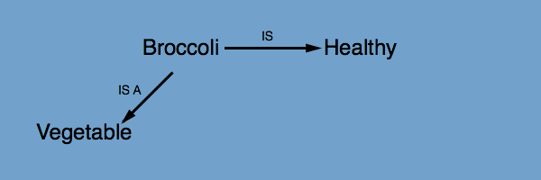
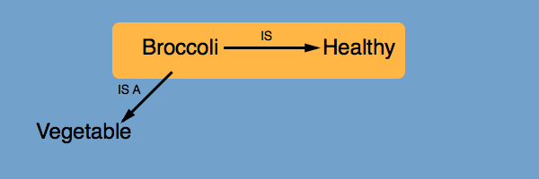
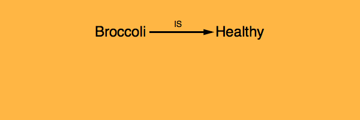
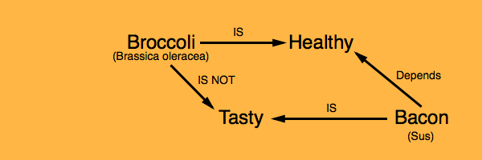
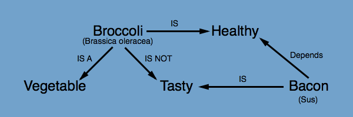

# Intro
vGraph is a distributable, versioned property graph database.

# Wait, Property Graph?
[Wikipedia](http://en.wikipedia.org/wiki/Graph_database) has an overview of what a graph database is.  
[TinkerPop](https://github.com/tinkerpop/blueprints/wiki/Property-Graph-Model) has an excellent definition of a property graph.

# Why should I care?
Lets say that you have data in a property graph that I want to operate on. Using vGraph, I can clone your graph, query and update it, and share the resulting changes back with you. I could even clone a portion of your graph, and then only get changes that apply to my subgraph when you make changes. And someone could clone my subgraph, etc.

# I still don't get it. Show me pictures.
OK, but note that this is an **extremely** simplified overview.

**A Graph**

**The yellow area is what we want to clone**

**The resulting cloned repository**

**And now some edits and commits**

**We can share and apply those commits to the original repository**

**This process can be done ad infinitum**