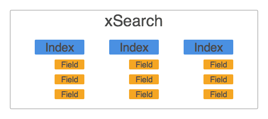

# xSearch
Searching all the things.

**Version** 0.1.0




# Overview
xSearch is composed of several indexes, each of which has a specific set of fields that are available for querying. Queries are submitted to xSearch in a standard format, and routed to a specific index. The results are returned, with each index defining its own results format.


# Definitions

* Field - A Particular field to search within. If no field is specified in a query the default is used.
* Phrase - One or more words to search for in a field.
* Query - A String of field:phrase pairs separated by :.
* Special Characters - The following characters are have special meaning in a query string
    * `:` - The Field/Phrase separator.
    * `(`, `)`, `&&`, `||` - Reserved for future use in logical grouping.
* Type - There is a different set of labels for each type (Person, etc...)


# Query
All queries share the same format.

````javascript
{
  "index": "person",
  "fields": {
    "<field>": "<phrase>",
    ...
  }
}
````

** Query Strings** While query strings are not directly supported by xSearch, it is recommended that implementors allow users to pass in a query string in the format `label:phrase label:phrase`, restrict query strings from using the `Special Characters` as defined above, and automatically parse query strings into query objects.


# Indexes

### Person
Search for persons

**Fields**

* `name` (default) - The full name(s) of the person.
* `birth-date` - The birth date. Phrase must be a GEDCOM-X date range.
* `birth-place` - The birth place.
* `death-date` - The death date. Phrase must be a GEDCOM-X date range.
* `death-place` - The death place.

**Results Format**

````javascript
{
  "id": "1234", // The person id
  "name": "a display name"
}
````

### Marriage
Search for marriage events

**Fields**

* `spouse` (default) - The full name of a spouse.
* `date` - The marriage date. Phrase must be a GEDCOM-X date range.
* `place` - The marriage place.

**Results Format**

````javascript
{
  "id": "1234", // The marriage id
  "description": "A description of the marriage"
}
````